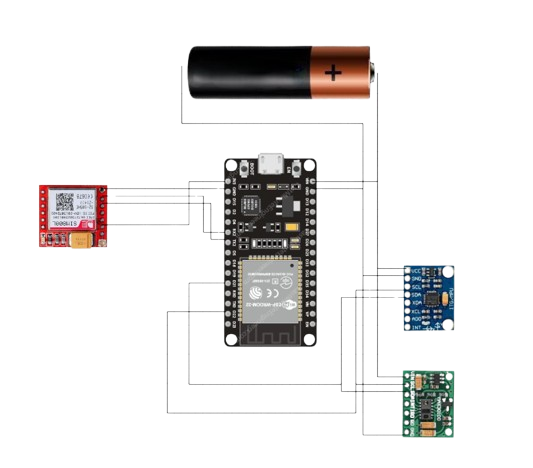

# NeuroGuard: Wearable Edge-AI Seizure Detection System


Shifting epilepsy care from reactive emergency response to proactive protection through real-time, low-latency machine learning on the edge.

## 1. Project Abstract
NeuroGuard is an untethered, medical-grade smartwatch prototype designed to combat Sudden Unexpected Death in Epilepsy (SUDEP). Traditional motion monitors suffer from high false-positive rates during daily tasks (e.g., brushing teeth), leading to alarm fatigue.

NeuroGuard solves this utilizing Multi-Modal Sensor Fusion and Edge-AI. By processing 3-axis spatial motion and optical photoplethysmography (PPG) data locally on an ESP32 via a quantized 1D-Convolutional Neural Network (CNN), the device accurately isolates tonic-clonic tremors. Upon classification, the device autonomously dispatches a Priority-1 emergency payload to a Cloud database, instantly triggering a Caregiver Companion App to broadcast local first-aid instructions and dispatch a GPS-routed emergency SMS. The entire system is housed in a custom-engineered, 3D-printed wearable enclosure.

## 2. Core Features
- **On-Device Inference (TinyML)**: Executes local machine learning classification in under 20ms. Operating on the edge ensures patient data privacy and removes dependency on cloud-computing latency during a medical crisis.
- **Sensor Fusion Engine**: Fuses MPU-6500 spatial acceleration data with MAX30102 physiological cardiovascular data to mathematically differentiate between harmless daily activities and actual physiological emergencies.
- **Bare-Metal I2C Protocol**: Bypasses standard hardware libraries by utilizing raw C++ register-read commands, ensuring 100% stable 50Hz data acquisition and preventing I2C bus lockups.
- **Ergonomic Wearable Design**: Features a custom parametric 3D-printed chassis with specialized sensor cutouts for ambient light occlusion and rigid IMU mounting.

## 3. System Architecture & Circuit Diagram

### Circuit Diagram


### Hardware Stack
- **Microcontroller**: ESP32 NodeMCU (Dual-core 240MHz, 520KB SRAM)
- **Motion Sensor**: MPU-6500 (3-Axis Accelerometer & Gyroscope)
- **Physiological Sensor**: MAX30102 (Optical Pulse Oximeter / PPG)
- **Cellular Gateway**: SIM800L 2G GSM Module (For SMS dispatch)
- **Power Delivery Network (PDN)**: 3.7V 400mAh LiPo Battery + TP4056 Linear Charger.

### Software Stack
- **Embedded Firmware**: C++ / Arduino Core
- **Machine Learning**: TensorFlow Lite Micro (EloquentTinyML engine)
- **Cloud Backend**: Firebase Realtime Database (REST API via `<HTTPClient.h>`)
- **Mobile Interface**: Cross-platform Caregiver Dashboard

## 4. Hardware Wiring & Pinout Specification
The system utilizes a shared I2C bus with native 3.3V logic for the sensors, alongside a dedicated UART communication line for the GSM module.

| Component | Component Pin | ESP32 Pin / Power Routing | Engineering Notes |
| :--- | :--- | :--- | :--- |
| MPU-6500 | VCC | VIN (5V) | Powers internal LDO regulator for I2C stability |
| MPU-6500 | GND | GND | Common Ground |
| MPU-6500 | SDA | GPIO 21 | Shared I2C Data |
| MPU-6500 | SCL | GPIO 22 | Shared I2C Clock |
| MPU-6500 | AD0 | GND | Hardware address lock (0x68) |
| MAX30102 | VCC | 3.3V or VIN | Dependent on specific breakout LDO |
| MAX30102 | SDA | GPIO 21 | Shared I2C Data |
| MAX30102 | SCL | GPIO 22 | Shared I2C Clock |
| SIM800L | VCC | BAT+ (Direct) | Must bypass ESP32 regulator to handle 2A transmission spikes |
| SIM800L | GND | GND | Common Ground |
| SIM800L | TX | GPIO 16 (RX2) | Hardware UART2 |
| SIM800L | RX | GPIO 17 (TX2) | Requires a 2.2kΩ series resistor to step down 3.3V logic to 2.8V |

**Power Delivery Note**: A 1000µF low-ESR decoupling capacitor is integrated across the SIM800L VCC and GND pins to suppress transient current spikes and prevent microcontroller brownout resets. (Note: Full software implementation of the SIM800L was paused during the hackathon due to time constraints, but the hardware architecture supports it natively).

## 5. Mechanical Design & 3D Enclosure
To translate the raw hardware into a functional wearable prototype, a custom enclosure was modeled and fabricated using FDM (Fused Deposition Modeling) 3D printing. The design files (.stl and .scad) are provided in the `/3D_Models` directory.

**Enclosure Specifications:**
- **Two-Part Clamshell Design**: Features a base chassis and a snap-fit top lid for rapid assembly and internal hardware maintenance during testing.
- **Biometric Sensor Port**: The base includes a precision 15x12mm cutout with a 1mm extruded lip. This forces the MAX30102 sensor to maintain flush contact with the user's skin, effectively occluding ambient light to prevent photoplethysmogram (PPG) signal corruption.
- **Rigid IMU Mounting**: The MPU-6500 is rigidly affixed to the internal base plate. This prevents the plastic enclosure from acting as a mechanical shock absorber, ensuring zero loss of high-frequency tremor data.
- **Integrated Strap Lugs**: Built-in 24mm lugs allow for the use of an elastic/velcro strap, providing the constant, gentle pressure required for accurate optical heart-rate monitoring.
- **Material**: Polylactic Acid (PLA) for thermal stability and rapid prototyping.

## 6. Machine Learning Pipeline (TinyML)
The localized detection algorithm is built on a custom 1D-Convolutional Neural Network (CNN), designed specifically for multi-channel time-series data.
- **Data Acquisition**: The ESP32 collects a rolling window of 300 timesteps across 4 features (Accel X, Y, Z, and raw IR PPG), resulting in a [1200] element flat input array.
- **Feature Extraction**: The 1D-CNN identifies rhythmic 3-8 Hz oscillations indicative of tonic-clonic tremors, whilst monitoring standard deviation in the optical PPG data.
- **Quantization**: The trained model is quantized to 8-bit integer weights using TensorFlow Lite, compressing the model size to under 32KB to fit within the ESP32's SRAM constraints.
- **Deployment**: The model is converted to a C-byte array (`model.h`) and executed on-device using the EloquentTinyML wrapper.

*(For detailed model training scripts, datasets, and architecture diagrams, refer to the `/Machine_Learning` directory).*

## 7. Repository Structure
```text
├── Firmware/
│   ├── Seizure_ESP32/
│   │   ├── Seizure_ESP32.ino    # Main C++ embedded firmware (Wi-Fi, I2C, Firebase)
│   │   └── model.h              # Compiled C-byte array of the quantized TinyML model
│   └── SIM800L_Diagnostics/     # UART debugging scripts for GSM initialization
├── Machine_Learning/
│   ├── dataset_generation.py    # Python scripts for synthetic & real data parsing
│   └── train_1d_cnn.ipynb       # Jupyter notebook for TFLite model training
├── App_Dashboard/               # Caregiver Mobile Application Source Code
│   ├── lib/                     # Flutter/Dart UI and Firebase Listeners
│   └── assets/                  # Audio files for emergency broadcasts
├── 3D_Models/
│   ├── NeuroGuard_Enclosure_Combined.stl # 3D Printable combined base and lid
│   └── enclosure_source.scad             # Parametric OpenSCAD source code
├── Docs/
│   ├── circuit_diagram.png      # Hardware schematic
│   └── system_architecture.pdf  # High-level data flow diagrams
└── README.md
```

## 8. Installation & Setup
### Embedded Firmware Deployment
1. Install the Arduino IDE and configure the ESP32 Board Manager via Espressif.
2. Install the required libraries via the Library Manager:
   - SparkFun MAX3010x Pulse and Proximity Sensor
   - EloquentTinyML (Version 0.0.10 strictly for self-contained TFLite compatibility).
3. Open `Firmware/Seizure_ESP32/Seizure_ESP32.ino`.
4. Update the network credentials and Firebase REST API endpoint:
```cpp
const char* ssid = "YOUR_SSID";
const char* password = "YOUR_PASSWORD";
const char* firebase_url = "https://your-project.firebaseio.com/telemetry.json";
```
5. Ensure `model.h` is present in the sketch directory and compile/upload to the ESP32 Dev Module.

## 9. Hackathon Context & Disclaimer
This prototype was engineered during a 48-hour hackathon to demonstrate the feasibility of combining Edge Computing, 3D Fabrication, and biomedical sensors.

**Disclaimer**: This system is an experimental proof-of-concept and is not FDA-certified for clinical, diagnostic, or life-saving use. Real-world deployment requires rigorous clinical trials, individual patient calibration, and certified medical hardware enclosures.
